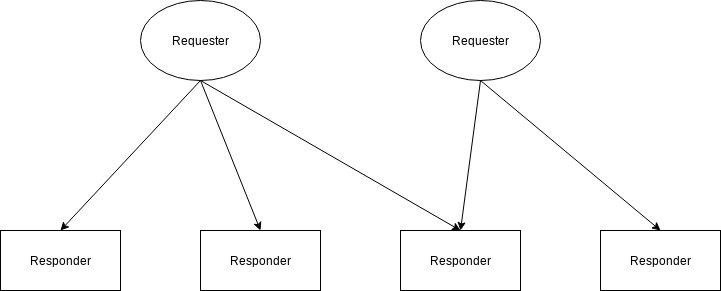

# Deku

C++ library for microservices. Inspired by [cote](https://github.com/dashersw/cote), [libp2p](https://github.com/libp2p/specs) and [Dask Distributed](https://distributed.dask.org/en/latest/). Targeted platform is **Linux** (Docker).

Project for "Basic of programming 2" course at Budapest University of Technology and Economics (BME).

## Table of Contents

1. [Goal](#goal)
2. [High level overview](#hoverview)
3. [Project structure](#structure)
4. [Development](#dev)
5. [Specification](#spec)

## Goal

There are a few goals for this project:

1. Learn C++ and it's advanced features.

2. Learn low-level networking or simply - socket programming. That is why, for example, [boost](https://www.boost.org) libraries are not used.

3. Learn the basics of distributed systems by implementing a simple one.

To make a development process easier, I will assume that the network is secure and all participants (nodes) are acting honestly.

**The library is not intended to be used in production.**

<a name="hoverview"></a>

## High level overview

**Deku** (library name) will provide the ability to create two types of **nodes** in the network (naming is taken from *cote* library):

- Responder
- Requester

Generally, *Responder* will provide certain functions that *Requester* can call. *Responder* will process the results and send them back to *Requester*. Functions are developed by library users.

The number of Responders and Requesters can be dynamically adjusted. New nodes can be added to the network and removed. *Deku* will handle the discovery of other nodes and communication between them. The current plan is to use [Redis](https://redis.io) in-memory storage for the discovery purposes.

From a graph theory perspective, Responders and Requesters are two **independent** sets in the directed bipartite graph. *Responders* communicate **only** with *Requesters* and vice-versa. In addition, Responders cannot start communication with Requesters. It reduces the number of connections needed and simplifies the design.




<a name="structure"></a>

## Project structure

Root file structure overview:

- `build/` - executable files
- `include/` - headers or source code of external libraries
- `libs/`- compiled external libraries (*.a or *.so extensions)
- `src/` - source code (*.cpp and *.h extensions)
- `tests/` - unit tests

<a name="dev"></a>

## Development

External libraries used:

- `hiredis`, to connect to Redis memory storage
- `msgpack-c`, to serialize/deserialize data
- `stdlog` (1.x version), logging library
- `catch2`, testing framework

<a name="spec"></a>

## Specification

**IMPORTANT!** This section will serve as a place for specification, design ideas,
considerations, etc. It will change rapidly and, hence, accuracy will be low for some time. Do not take it as source of truth for now. Thank you.

### Socket data encoding/decoding

Data is sent between Requesters and Responders using chunks with **fixed** size in bytes (default value is not specified, for now).
The first byte of every chunk (**control byte**) indicates whatever you need to read the next chunk. If first byte = `\x01`, read the next chunk of data, else stop reading.
If data in the last chunk is smaller than chunk size `\x00` bytes are added to match chunk size. Control bytes are not included in the final decoded result.

Example:

```
data = `\x93\x01\x02\x03` (4 bytes)
chunk size = 4 bytes

encoded data = `\x01\x93\x01\x02 \x00\x03\x00\x00` (8 bytes, 2 chunks needed)
```

Idea of control byte is taken from [unsigned-varint](https://github.com/multiformats/unsigned-varint#spec) specification for Multiaddr format.

### Message encoding/decoding

On top of socket data handling, [**msgpack**](https://msgpack.org) serialization format is used for encoding/decoding messages between Requester and Responders. It is very simple, efficient format that does not require additional headers/schema.

### Protocols

| name         | code (int) | function  |
| ------------ |:----------:|:---------:|
| process job  | 2          | execute requested function with user-defined input bytes and return byte results |
| ping         | 1          | check if Responder is up, returns "pong" in byte results |
