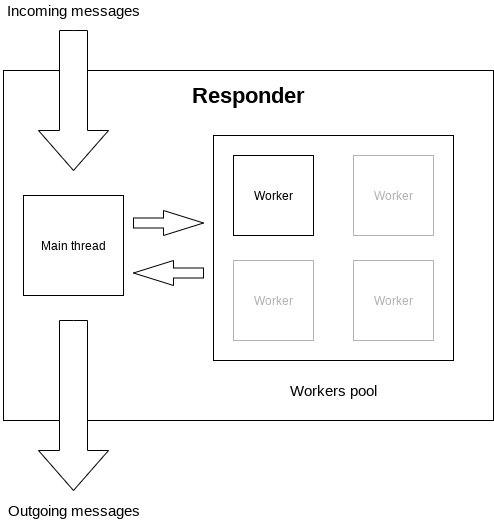

# Deku

C++ library for microservices. Inspired by [cote](https://github.com/dashersw/cote) and [Dask Distributed](https://distributed.dask.org/en/latest/). Powered by [ZeroMQ](https://zeromq.org). Targeted platform is **Linux**.

**IMPORTANT! The library is not intended to be used in production. Yet...**

Project for "Basics of programming 2" course at Budapest University of Technology and Economics (BME).

Simplified example:

- responder.cpp

```c++
Responder res = Responder();

res.on("echo", [] (const std::stringstream& input, std::stringstream& output) {
    // input sstream is a data that Requester send (input.str() == "hello world")
    // output sstream is a data that will be returned back to Requester as a response
    output.write(input.str().data(), input.str().size());
});

// starts main thread and worker to process requests and jobs, blocking
res.start();
```

- requester.cpp

```c++
// starts Agent in separate thread to process messages
Requester req = Requester();

// send a string "hello world" to any Responder that available and supports "echo" task
std::stringstream reply = req.send("echo", "hello world");
std::cout << reply.str() << std::endl;
// "hello world"
```

## Table of Contents

1. [Goal](#goal)
2. [High level overview](#overview)
3. [Specification](#spec)
4. [Implementation](#impl)
    1. [Project structure](#structure)
    2. [External libraries](#external)
5. [Known issues](#issues)
6. [Development](#dev)
7. [Credits](#creds)
8. [Why "Deku"?](#why)

## Goal

Creating even a primitive distributed system is hard. This library aims to provide a high-level API to be able to build a simple system that is capable of distributing jobs between many computers. It is designed to be used with Docker + cloud (think, GCP + Kubernetes).

In addition, this is also a project for my C++ university course. While working on *Deku*, I have learned a ton of new stuff about the language and distributed systems.

To make a development process easier, I will assume that the network is secure, network has infinite capacity and all participants (nodes) are acting honestly.

<a name="overview"></a>

## High level overview

**Deku** will provide the ability to create two types of **nodes** in the network (naming is taken from *cote* library):

- Responder
- Requester

Generally, *Responder* will provide certain functions that *Requester* can excecute. *Responder* will process the job(s) sent by *Requester* and return results back. Functions are developed by library users.

The number of Responders and Requesters can be dynamically adjusted. New nodes can be added to the network and removed. *Deku* will handle the discovery of new nodes and communication between them. My priority goal is to support usage of library in the cloud. Because, cloud providers do not support UDP broadcasting, currently, the only way of discoverying new nodes in *Deku* is to use [Redis](https://redis.io) in-memory database.

From a graph theory perspective, Responders and Requesters are two **independent** sets in the directed bipartite graph. *Responders* communicate **only** with *Requesters* and vice-versa. Responders cannot start communication with Requesters. It reduces the number of connections needed and simplifies the design.


<a name="spec"></a>

## Specification

Here you can find the design description of the library. Code is not discussed here. If you are interested in implementation, please, check [Implementation](#impl) section.

### Responder

*Responder* is designed to be a non-blocking server. While jobs are excecuting inside **workers** in the background, other incoming messages can be handled by **main thread**. When job is ready, worker will communicate it to the main thread and main thread will send the results back to *Requester*. Currently, only single worker is supported (one job at a time), but it can be extended pretty easly.



### Requester

*Requester* is asynchronous client that is using similar idea as *Responder*. It creates a separate **single** worker in the background that can send and receive messages independently. Main client is communicating with worker to send or receive messages. Currently, one message at the time is supported. This can be extended.

Because *Deku* doesn't have a centralised scheduler, independent *Requesters* are responsible for scheduling their own jobs. Current algorithm is using approach described in [ZeroMQ guide](http://zguide.zeromq.org/page:all#toc112). *Requester* will try to send a message to each known *Responder* one by one until it succeceed or job expired.

### Protocol

*Requester* and *Responder* are using a set of pre-defined operational codes (**opcodes**) to communicate over the network. Based on value of opcode, they will take a different action. A simplified list of opcodes with short desciption is specified below.

| Opcode(s)    | Description | States             |
|:----------:|:-----------:|:------------------:|
| PING/PONG  | check if Responder is alive by sending probe request ||
| TASK       | accepting and rejecting jobs from Requester |   OK, BUSY, RESULT |

<a name="impl"></a>

## Implementation

Here implementation details of the project are discussed.

Deku is written in **C++14** and was tested only on **Linux**. Initially, I was thinking to use a raw sockets to develop the library, but after some time I realized that there are so many different edge cases and issues you can encounter. Instead, I decided to use an amazing networking and threading library called [ZeroMQ](https://zeromq.org). ZeroMQ not only simplifies the development of the project, but also allows, in future, to make *Deku* stable, performant and easy to use.

<a name="external"></a>

### External libraries

External libraries used:

- `hiredis`, C library to connect to Redis
- `czmq`, high-level C Binding for ZeroMQ

<a name="structure"></a>

### Project structure

Root files structure:

- `build/` - executable files
- `examples/` - some examples of using the library
- `include/` - headers or source code of external libraries
- `libs/`- compiled external libraries (*.a or *.so extensions)
- `src/` - source code (*.cpp and *.h extensions)
- `Makefile` - collection of commands to build a C++ project

### Class structure

<a name="issues"></a>

## Known issues

<a name="dev"></a>

## Development

Here you can find information how to setup a project and compile it by yourself.

<a name="creds"></a>

## Credits

...

<a name="why"></a>

## Why "Deku"?

...
